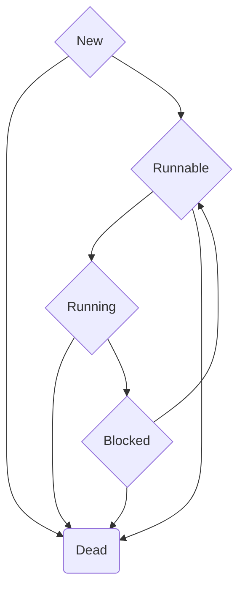

## 多线程（Thread）

继承线程类，重写run方法，

synchronized修饰实例方法，相当于


Tread.yield;

//线程类的静态方法，


### 线程的生命周期

```mermaid
graph LR
id1(新建New)==start==>id2(可运行Runnable)
id5-->id6(Dead)
id2-->id4(正在运行Running)--join--wait--sleep-->id5(Blocked)-->id2
id1-->id6


```

